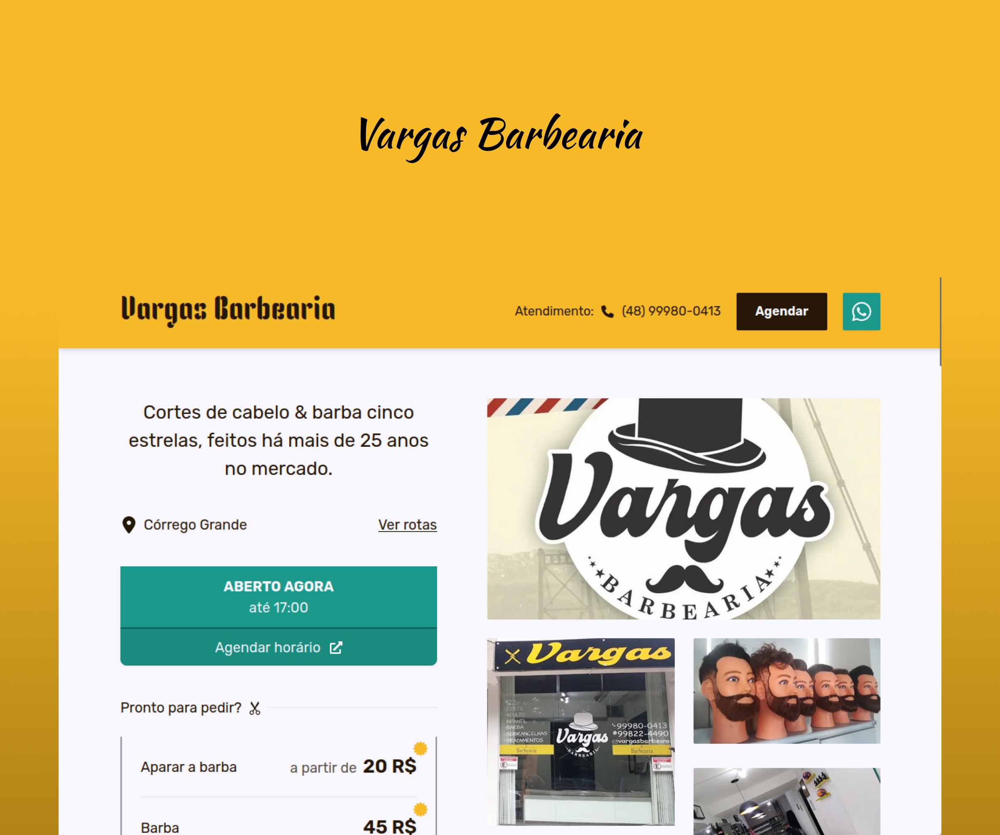

  

<h1 align="center">Vargas Barbearia</h1>

Projeto de página WEB de barbearia real, para freelance.

  <a href="#-tecnologias">Tecnologias</a>&nbsp;&nbsp;&nbsp;|&nbsp;&nbsp;&nbsp;
  <a href="#-projeto">Projeto</a>&nbsp;&nbsp;&nbsp;|&nbsp;&nbsp;&nbsp;
  <a href="#-layout">Layout</a>&nbsp;&nbsp;&nbsp;|&nbsp;&nbsp;&nbsp;
  <a href="#memo-licença">Licença</a>

  

  

## 🚀 Tecnologias

Esse projeto foi desenvolvido com as seguintes tecnologias:

- NextJS v14
- TailwindCSS
- Typescript
- Google Geocode API
- Git e Github
- Figma
- Vercel

## 💻 Projeto

Este projeto foi feito e faz referência a uma barbearia real, com o intuito de atrair clientes, apresentando o estabelecimento.

- [Acesse o projeto finalizado, online](https://barbearia-javc.vercel.app)

## 🔖 Layout

Você pode visualizar o layout do projeto através [DESSE LINK](https://www.figma.com/file/x9ujjF9mphCUuMQErluqEA/Barbearia?type=design&node-id=0%3A1&mode=design&t=AJaZToW2cYrT8EmO-1).

## :memo: Licença

Esse projeto está sob a licença MIT.

---

Feito por Gustavo Zonta :wave:

